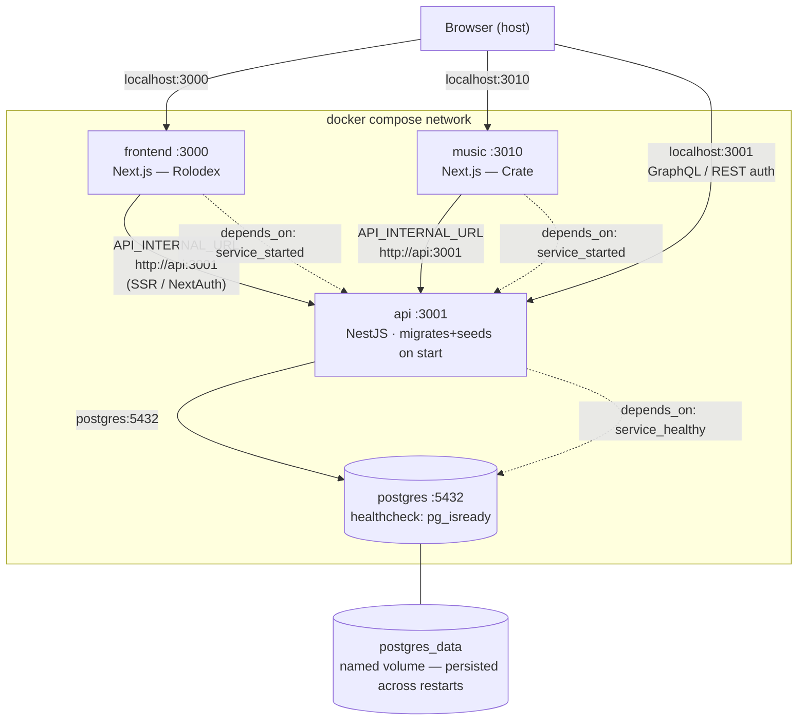

# CLAUDE.md

This file provides guidance to Claude Code (claude.ai/code) when working with code in this repository.

## Project overview

GammaRay is a POC whose goal is to develop a reliable tech stack that can be coded by agents (the engineering team is Alan Berezin plus various agents). The example app, **Rolodex** (`apps/example`), is a small contact CRM (contacts, companies, categories, tags) built entirely on the generic, descriptor-driven type-A engine — it exercises offline-first sync, references, many-to-many, and conflict resolution. A second example, **Crate** (`apps/music`, a music library), reuses the same engine to prove the framework is app-agnostic. (A hand-built single-textarea "note" feature was the original first app; it predated the generic engine and was retired once the engine could express everything generically — see ADR-era history and migration `DropNotes`.)

## Local machine

**Check `LOCAL.md` first** — it is git-ignored and contains machine-specific environment details that affect how this repo runs. If it doesn't exist, copy `LOCAL.example.md` to `LOCAL.md` and fill in your setup.

Examples of what goes in LOCAL.md:
- Package manager and tool locations (`brew` vs MacPorts, global npm prefix)
- Node version manager and PATH configuration
- Container runtime (Docker Desktop vs Colima)
- Database connection details and how services are started locally
- Any OS-specific quirks or workarounds

Agents will read LOCAL.md to understand your machine's configuration and avoid environment-specific gotchas.

**For development and Chrome testing, see `DEV_SETUP.md`** — comprehensive guide explaining:
- How to run the full stack
- How to run frontend locally for Chrome testing (recommended)
- The Colima port forwarding quirks and why port 3000 hangs
- How to stop the containerized frontend and run it locally

## Commands

```bash
# Install all workspace dependencies
pnpm install

# Start everything (API + frontend)
pnpm dev

# Start individual apps
pnpm --filter @gammaray/api dev          # NestJS API on :3001
pnpm --filter @gammaray/example dev      # Next.js frontend on :3000

# Build
pnpm build                               # all packages and apps
pnpm --filter @gammaray/core build       # must run before api builds

# Type-check (no emit)
pnpm --filter @gammaray/api lint
pnpm --filter @gammaray/example lint

# Run database migrations
pnpm --filter @gammaray/database db:migrate

# Start PostgreSQL (required before running API)
docker compose up -d

# Load tests (k6) — API must be running on :3001
k6 run load-tests/k6/single-socket.js    # baseline; see load-tests/README.md
```

Build order matters: `packages/core` → `packages/rolodex-schema` → `packages/database` → `apps/api`. (`@gammaray/core` is the framework — the descriptor *system* + generic merge/sync logic; `@gammaray/rolodex-schema` holds the example app's concrete `TableDescriptor`s built on it.) The `packages/ui` has no separate build step — Next.js transpiles it directly.

## Architecture

### Repository structure

```
apps/api          NestJS backend — GraphQL + REST auth endpoints
apps/example      Next.js 15 frontend (App Router)
packages/core     Framework: the descriptor system (FieldKind, TableDescriptor, MergeStrategyKind), shared DTOs/enums (SyncStatus, ConflictStatus), generic merge + dependency-order logic
packages/rolodex-schema  The Rolodex example app's data model: the concrete TableDescriptors (contact, company, category, tag) built on @gammaray/core. Swap this to drive a different app.
packages/auth     JwtPayload interface shared between api and the example app
packages/database TypeORM entities, migrations, and data source config
packages/ui       Framework React components (RecordForm, RecordList, RecordConflictBanner, Pagination, OfflineToggle, SyncIndicator) — all descriptor-driven
load-tests        k6 load tests for the realtime path (see load-tests/README.md + RESULTS.md)
```

### Data flow

```
RxDB (IndexedDB)  ←→  NestJS GraphQL  ←→  PostgreSQL
     ↑                     ↑
     └──── WebSocket subscription (rowUpdated) for live push
```

RxDB is the authoritative local store; the generic client runtime (`@gammaray/client`) replicates every descriptor's collection via `replicateRxCollection` (`packages/client/src/batch-sync.ts`). Pull is polling + the `rowUpdated` WebSocket stream; push calls the generic `pushBatch` mutation. (A `paged` table fetches its list via `pageRows` instead of full-replicating — ADR 0013.)

### Conflict resolution

The generic engine (`GenericRowService.applyRow` in `apps/api/src/engine/generic-row.service.ts`) implements optimistic concurrency with a DB row lock, for every type-A table:
- Client sends `expectedVersion`; if the server's `row.version !== expectedVersion` → conflict (a `revisioned` table first attempts a 3-way merge against the common ancestor; see ADR 0010).
- The conflicted client revision is persisted as `conflictStatus: 'detected'` in the generic `row_revisions` table.
- The frontend receives the server row in a `RowConflict` and surfaces the generic `RecordConflictBanner` ("Keep mine / Keep theirs").
- Resolution calls the `resolveRowConflict` mutation, which stamps the revision `conflictStatus: 'resolved'`.

### Stateless / multi-instance design

`SyncBroker` (`apps/api/src/sync/sync.broker.ts`) wraps PubSub behind an interface. Today it uses in-process `graphql-subscriptions` PubSub. To scale horizontally, replace with `RedisPubSub` — no caller changes needed.

Auth is fully stateless JWT. No server-side session storage.

### Schema evolution strategy

- TypeORM migrations only — `synchronize: false` everywhere
- New columns must be nullable or have a DEFAULT (additive-only rule)
- Every entity has a `metadata: JSONB` column as an escape hatch for fields not yet promoted to first-class columns
- Migration files live in `packages/database/src/migrations/`

### Key files

| File | Purpose |
|------|---------|
| `apps/api/src/engine/generic-row.service.ts` | Generic applier: conflict logic, 3-way merge, revisions, `pageRows` |
| `apps/api/src/engine/rows.resolver.ts` | Generic GraphQL surface (`rows`/`pushBatch`/`rowUpdated`/`pageRows`/…) |
| `apps/api/src/sync/sync.broker.ts` | PubSub abstraction (swap here for Redis) |
| `packages/client/src/batch-sync.ts` | RxDB replication + BatchCoordinator (push) wiring |
| `packages/client/src/use-record-page.ts` | Generic client data-layer for one type-A table |
| `packages/client/src/rxdb.ts` | RxDB database init (Dexie storage) |
| `packages/database/src/migrations/` | TypeORM migration files |
| `platform-architecture.md` | Architecture decision log — update when decisions change |

## Containerization

All four services (PostgreSQL, API, and the two example frontends) are containerized with `docker compose`. The runtime on macOS is **Colima** (not Docker Desktop). See `DEV_SETUP.md` for the full guide.



- **Published ports** (`host:container`): `3000:3000` (Rolodex), `3010:3010` (Crate), `3001:3001` (API), `5432:5432` (Postgres). All overridable via `PORT`/`MUSIC_PORT`/`API_PORT`/`DB_PORT` env vars so parallel instances don't collide.
- **Internal DNS** — inside the compose network, services address each other by compose-service name (`postgres`, `api`). The two frontends never talk to each other; they meet only at the shared `api`.
- **Persistence** — only `postgres_data` (named volume) survives `docker compose down`. Application containers are rebuilt from Dockerfiles; source is bind-mounted for hot-reload in dev (`./apps/*/src`, `./packages`). Under claudebox those bind-mounts are stripped via `docker-compose.override.yml` `!reset []` because the workspace path is not visible to the Colima VM.
- **Startup order** — Postgres must be `healthy` (pg_isready) before the API starts; the API only needs to be `started` before the frontends launch. The API's CMD runs `db:migrate` then `db:seed` before `dev`, so migrations always apply on boot.

**Recommended: full stack in Docker** (verified — auth + e2e suite pass against it):
```bash
docker compose up -d   # frontend :3000, API :3001, Postgres :5432
```
Open http://localhost:3000 in Chrome. Colima forwards both published ports to the host; there is **no** port-forwarding limitation.

**Browser-side vs server-side API URL (the key gotcha):** the frontend reaches the API from two places that need different URLs when containerized:
- **Browser-side** (RxDB sync, GraphQL, register form) → `NEXT_PUBLIC_API_URL=http://localhost:3001` (the host's published port).
- **Server-side** (NextAuth `authorize`/refresh in `apps/example/src/auth.ts`) → `API_INTERNAL_URL=http://api:3001` (the compose service name). Inside the frontend container `localhost:3001` is the frontend itself, not the API. Both are set in `docker-compose.yml`. Getting the server-side one wrong looks like "Invalid email or password" on every login.

**Alternative: frontend on the host** (fast Fast-Refresh iteration) — run `docker compose up -d postgres api` then `pnpm --filter @gammaray/example dev`. On the host, `localhost:3001` works for both call sites, so `API_INTERNAL_URL` is not needed.

**If `localhost:3000` hangs:** it's a stale host process on the port, not Colima — `lsof -nP -i :3000` and kill any `node`/`next-server` (Colima's own forwarder shows up as `ssh`).

**Dockerfiles:**
- `apps/api/Dockerfile` — NestJS on :3001, runs migrations on startup
- `apps/example/Dockerfile` — Next.js on :3000 (binds `0.0.0.0` so the container is reachable)

**Accessing from the Colima VM IP (e.g. `192.168.64.13:3010`) — three extra gotchas:**
1. **CORS** — The API's `CORS_ORIGINS` env var must include the VM IP. Set in `docker-compose.override.yml`.
2. **Next.js `allowedDevOrigins`** — In dev mode, Next.js 15 blocks RSC flight data from non-localhost hosts. Without `allowedDevOrigins: ['192.168.64.13']` in `next.config.ts`, React never hydrates (the page shows SSR HTML only; no RxDB, no sync).
3. **`crypto.randomUUID` insecure context** — `randomUUID()` requires HTTPS or localhost. Accessing via a plain `http://` VM IP breaks it. The `use-record-page.ts` helper falls back to `crypto.getRandomValues()` for these contexts.

## SDLC

### Branching

- **Major version upgrades** (framework, runtime, major dependency): create a feature branch (e.g. `chore/next-upgrade-16`), commit there, then ask for review before merging. This gives a checkpoint to assess risk.
- **Other changes**: commit directly to main per the workflow ("commit after each major change; PRs only when asked").

### Testing

**All new features and bug fixes must be tested before committing.** Testing can be:

- **Automated (preferred):** Write a Playwright e2e test in `apps/example/tests/` that exercises the feature deterministically. Run with `pnpm --filter @gammaray/example test:e2e`
- **Manual (acceptable for simple UI features):** Start the dev stack (`docker compose up -d && pnpm --filter @gammaray/example dev`), manually test in Chrome, document test steps in the commit message or PR

**Examples:**
- **Sync indicator:** Test by toggling offline mode and verifying the indicator updates
- **Form validation:** Test by entering invalid data and checking error states
- **API endpoint:** Test with Playwright or curl to verify response codes and data shape

If automated testing is expensive or requires infrastructure setup, discuss with the team first — manual tests are acceptable if well-documented.

### Working with executable scripts

The Edit tool loses file permissions (executable bit) when modifying files. When editing shell scripts (`.sh`) or other executables:

1. After editing, restore the executable bit: `chmod +x scripts/your-script.sh`
2. Commit with: `git update-index --chmod=+x scripts/your-script.sh && git commit`

This ensures clones of the repo will have executable scripts. Examples: `scripts/dev-with-ports.sh`, `scripts/find-free-port.sh`.

### Git LFS — not used

This repo does **not** use Git LFS (no `.gitattributes` filters, nothing tracked). If a `git push` ever fails on `info/lfs/locks/verify` (a machine-level git-lfs install intercepting the push), disable the optional lock check for this clone:

```bash
git config lfs.https://github.com/aberezin/gammaray.git/info/lfs.locksverify false
```

(Per-clone `.git/config`, not committed — re-run after a fresh clone if needed.)

## Notes

- Two frontend applications (`apps/example`, `apps/app-two` placeholder) share one backend and must communicate only through it.
- Messaging broker (Redis vs RabbitMQ) is still an open decision — see `platform-architecture.md`.
- Commit conventions are not yet defined.

## TODO

- **Split `packages/database` into per-app database packages:** entities are now *grouped* (framework/rolodex/music subdirs + `FRAMEWORK_ENTITIES`/`ROLODEX_ENTITIES`/`MUSIC_ENTITIES`/`ALL_ENTITIES`, consumed in both registration sites — the double-registration footgun is fixed). The next rung is true decoupling: split the example groups into their own packages (`@gammaray/rolodex-database`, `@gammaray/music-database`), each owning its entities **and** migrations, leaving `@gammaray/database` as framework-only (`user`/`app_meta`/`row_revision` + the data-source factory + migrate runner). The API would compose `ALL_ENTITIES` from the framework + whichever app packages it serves, so adding an app touches no framework code. The wrinkle to solve: the migrate runner globs one `migrations/` dir, and the existing migration history is interleaved (e.g. `InitialSchema` creates `users`), so migrations must either be aggregated across packages at runtime or only split going forward. Pairs with the per-app logical-DB work (Phase 2, `docs/example-app-spec.md` §7d / `GAMMARAY_SCHEMAS`). Also: the engine's `schema-tables.ts` still hand-pairs descriptor↔entity per app — could consume the grouped arrays once the packages exist.
- **Data-epoch guard is load-time only → already-open clients silently go stale (ADR 0012):** `DataEpochGuard` checks `serverDataEpoch` once on mount (`useEffect([])`), and out-of-band server data changes (seed/migrate) write through the engine directly — NOT the mutation resolver — so they emit no live `rowUpdated` WebSocket events. Net: an already-open tab neither pulls the new rows live nor re-checks the epoch, so it shows stale data until the user happens to reload (the manual fix). The load-time reslate itself is correct + tested (`apps/example/tests/data-epoch.spec.ts`); the gap is *mid-session* detection. Options: (a) poll `serverDataEpoch` periodically (or subscribe to an epoch-changed WS event) while the app is open and prompt-to-reslate then; (b) have seed/migrate bump the epoch AND emit a lightweight "data changed" signal. Low priority for runtime (out-of-band changes are rare in prod), but it's the exact confusion the music seed caused (PR #29 — a pre-seed tab looked empty until reload). Also minor UX: declining the reslate prompt acknowledges the new epoch and never nudges again, leaving the client stale with no further cue.
- **M2m temporal validity: UI not yet surfaced.** Join tables now carry `effective_from`/`effective_to` (set by the engine on create/soft-delete; migration `1000000000012`). The history is queryable in Postgres and replicates to RxDB. What remains: (a) a "link history" panel in the record detail UI showing each link's active period; (b) a "last modified / recent activity" view on the parent fed by `effective_from`/`effective_to` without touching the parent's version/conflict semantics.
- **Server-managed fields show a stale local value briefly after a save (cosmetic):** When you edit a record, the client patches only the writable columns; the server bumps `version` (and `updated_at`) on apply, and that value comes back via the replication reconcile a round-trip later. So right after Save, the read-only `Version`/`Updated` fields in the detail form still show the pre-save local value (e.g. version 1) and only update to the bumped value (2) once the push reconciles — a quick glance can look like "the edit didn't bump the version" even though it did (confirmed: the engine bumps correctly, see `apps/api/src/engine/version.spec.ts`). Options: optimistically reflect the expected bump on save, show a transient "saving…/syncing…" state on those fields, or disable them until reconciled. Purely cosmetic; no data is wrong.
- **Generic manual-merge conflict resolution (framework feature gap):** The generic `RecordConflictBanner` offers only **Keep mine / Keep theirs** — the retired note app additionally let the user hand-edit a merged value before resolving. Bringing that to the framework means a field-aware merge editor in the banner (pick/edit per field, not whole-row) plus a `resolveWith(customRow)` path through `resolveRowConflict` (the mutation already accepts an arbitrary row, so the server side largely exists). Complex in the general case — fields have types (Reference/MultiReference/Int/Bool), so a generic per-field merge UI is non-trivial. Surfaced retiring notes (the note's textarea made manual merge trivial; a generic descriptor-driven one is not).
- **Generic "restore a past version" from history (framework feature gap):** `RecordPage` renders revision history read-only; the retired note app let the user restore a past revision into the editor. Generically this is "write an old `row_revisions` snapshot back as a new version" — needs a server op (re-apply a chosen revision's `data` as a fresh versioned write, with conflict semantics) and a Restore button per revision in the history list. Complex in the general case because a snapshot may reference rows/links that have since changed or been deleted (References/MultiReferences), so a naive restore can resurrect dangling refs. Surfaced retiring notes.
- **Stale local RxDB after builds → transient client errors; need a robust "reset the local store" path:** Observed (2026-06-30) an `ensureNotFalsy() is falsy:` RxDB error in the browser on both `:3000` and `:3010` after iterating through several builds; it cleared on reload and a *fresh* browser never hit it — so the cause is a **stale local IndexedDB replica** that accumulated across builds whose persisted shape changed underneath it (the `dbName` rename `notesync`→`rolodex`, descriptor field changes, and the data-epoch bump from `DropNotes`). The local replica is disposable (the server is authoritative), but today it only auto-heals on *schema-mismatch* RxDB codes: `getDatabase()` in `packages/client/src/rxdb.ts` wipes+rebuilds on `DB6`/`DM5`/`DM1` only (`isSchemaMismatch`), so any *other* init-time failure (like this `ensureNotFalsy`) throws instead of self-healing. Directions: (a) broaden `getDatabase()` to **retry-once** — on ANY build failure, `removeRxDatabase` + rebuild (and re-pull from the server) before giving up; (b) a build/version signal — bump a client "store version" (or detect a changed build id) and proactively reslate via the existing data-epoch machinery so a stale store is discarded on the first load after a deploy; (c) make the **"Reset local copy"** control more discoverable / surface it automatically when init fails. Low user impact in prod (the persisted shape is stable there), but it bites during rapid local iteration. Needs the actual `ensureNotFalsy` stack to confirm whether it fires at DB init (→ (a) fixes it) or during replication (→ different fix) before implementing.
