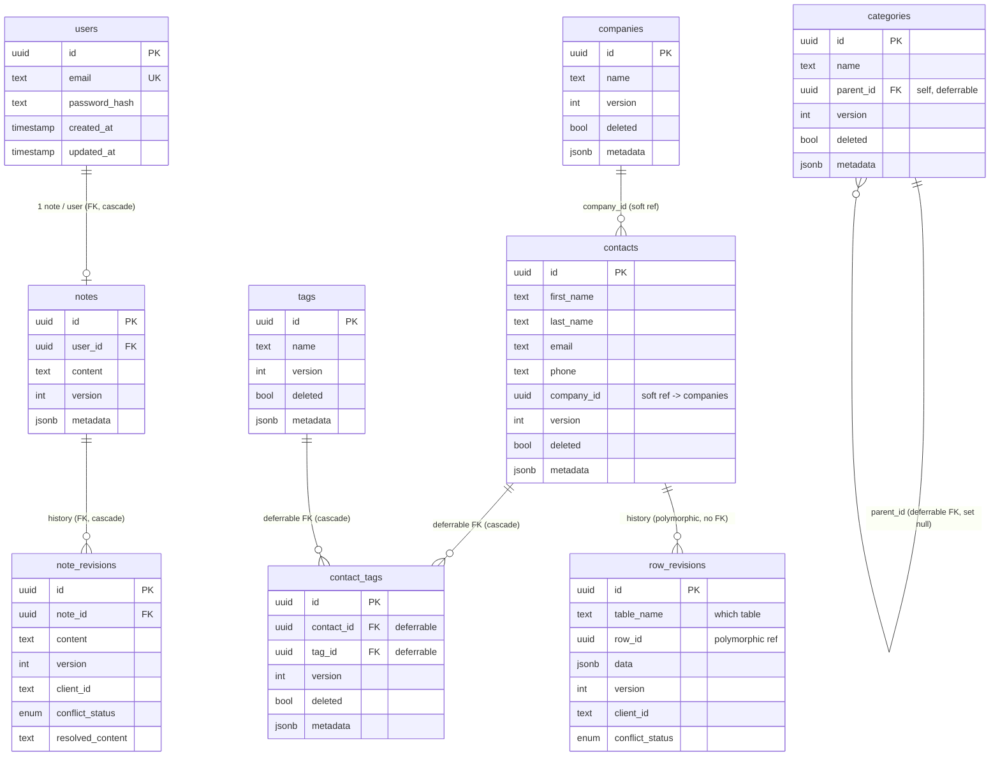

# Entity-Relationship Diagram

The PostgreSQL schema (via TypeORM entities in `packages/database`). Two regions:
the **note** app (the original single-textarea-per-user feature) and the
**type-A** tables (the generalized framework — `contacts`, `companies`,
`categories`, `tags`, `contact_tags`) plus the generic `row_revisions` log.

Every type-A table shares the same spine: a **client-generated `uuid` PK**, an
`int version` (optimistic concurrency), a `bool deleted` soft-delete tombstone, a
`jsonb metadata` escape hatch, and `created_at`/`updated_at`. They are driven by
`TableDescriptor`s and served by the generic engine (ADR 0009/0010).

## Relationship / constraint legend

The diagram's cardinalities are standard, but the **kind** of link varies — this
is deliberate and central to the offline-first design:

| Link | Kind | Why |
|------|------|-----|
| `users → notes`, `notes → note_revisions` | **Hard FK** (`ON DELETE CASCADE`) | Server-owned data with normal integrity. |
| `contacts.company_id → companies` | **Soft reference — no DB FK** | ADR 0005: rows sync offline-first from independent collections; a hard FK would reject a child that reaches the server before its parent. Integrity is advisory; a dangling id renders as `(unknown)`. |
| `categories.parent_id → categories` | **Deferrable FK** (`SET NULL`, `INITIALLY DEFERRED`) | Self-referential tree; deferring lets a parent + child sync in one batch in any order (ADR 0006). |
| `contact_tags.contact_id/tag_id → contacts/tags` | **Deferrable FKs** (`CASCADE`) | The M:N join row has two parents; deferred constraints + DB∪batch validation let the whole graph commit atomically (ADR 0007). A partial unique index `(contact_id, tag_id) WHERE deleted = false` keeps one active link. |
| `row_revisions → (any revisioned table)` | **Polymorphic, no FK** | Keyed by `(table_name, row_id)`; one log serves every revisioned table (today only `contacts`). ADR 0010. |

## Notes on the type-A spine

- **`version`** drives optimistic concurrency; the generic applier bumps it on
  every accepted write and detects conflicts on a mismatch.
- **`deleted`** is a tombstone (not a row removal) so deletions replicate.
- **`row_revisions`** is the field-aware history + the 3-way-merge common
  ancestor for `revisioned` tables (ADR 0010). `note_revisions` is the note app's
  own (pre-generalization) equivalent.
- **`conflict_status`** (`none` / `detected` / `resolved`) is a shared enum across
  `note_revisions` and `row_revisions`.
